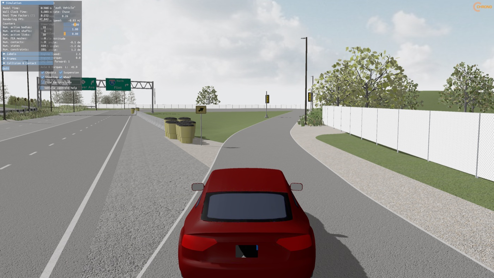

# chrono-mcity

The [Mcity Test Facility digital twin](https://github.com/mcity/mcity-digital-twin) as a drivable
[PyChrono](https://projectchrono.org) scene, in one Python script. It runs on stock PyChrono.
Nothing is converted and Chrono is not modified.



## Run it

```sh
conda install projectchrono::pychrono -c conda-forge
curl -LO https://raw.githubusercontent.com/ksha23/chrono-mcity/main/mcity.py
python mcity.py
```

The first run downloads the scene (211 MB) into `scene/` beside the script, checks its SHA-256
and unpacks it. Later runs start in a few seconds.

Drive with **W/S** for throttle and brake and **A/D** to steer.

| Option | |
| --- | --- |
| `--foliage LEVEL` | vegetation: `none`, `trees`, `trees-leaf`, `shrubs` or `full`. See below |
| `--signals COLOUR` | light the traffic signal lenses: `red`, `amber`, `green` or `all` |
| `--no-sky` | plain background instead of the sky dome |
| `--no-shadows` | do not draw shadows. Worth trying on a slow GPU |
| `--data DIR` | keep the scene somewhere else |
| `--tire pac02\|tmeasy\|rigid` | tire model, default `pac02` |
| `--tire-step S` | tire internal step in seconds, default `1e-4` |
| `--speed-limit V` | speed the throttle ramp is scaled toward, default 20 m/s |
| `--duration S` | stop after S simulated seconds |
| `--headless` | no window. Sets the car down with the brakes on and checks that it rests on the road |
| `--force` | load a vegetation level even if it looks too big for this machine |

PyChrono has to come from the `projectchrono` conda channel. The `conda-forge` package of the
same name has no vehicle or VSG module.

The simulation holds real time. When a frame takes too long to draw, the script skips frames
instead of slowing the car down.

## Vegetation

Trees and shrubs are optional. Asking for a level downloads a second archive (42 MB) the first
time, into the same `scene/` directory:

```sh
python mcity.py --foliage full
```

| Level | Plants | Triangles in the scene | Stock PyChrono, shadows on |
| --- | --- | --- | --- |
| `none` | none | 1.4 M | 46 frames/s, 5 GB |
| `trees` | 447 trees, bare branches | 4.0 M | 44 frames/s, 6 GB |
| `trees-leaf` | 447 trees with leaves | 5.4 M | 43 frames/s, 7 GB |
| `shrubs` | 2,009 trees and shrubs, bare branches | 5.9 M | 40 frames/s, 7 GB |
| `full` | 2,009 trees and shrubs with leaves | 5.9 M | 38 frames/s, 8 GB |

Measured on PyChrono build 1187 on an M4 Pro, at real time.

The plants upstream are film-grade models, about 1.85 billion triangles for the site once their
instanced branches are expanded. Stock Chrono::VSG draws every triangle of a scene every frame,
and again for each shadow map, and on that machine it falls from 40 frames a second to 12
somewhere between 6 and 8 million triangles. So each level is built to stay under 6 million.

A tree gets about 7,000 triangles. Its trunk is welded down. Each branch keeps its few real
stems, redrawn as tapered sticks, and loses most of its thousand twigs. Its leaves are thinned
to about a thousand, each drawn as a simple outline and enlarged to win back cover, up to a
twentieth of the tree's height. That is larger than a real leaf and it shows up close. From the
road it reads as a tree.

## Use Mcity in your own simulation

`mcity.py` is also a module. Put it next to your script:

```python
import pychrono as chrono
import pychrono.vehicle as veh
import mcity

system = chrono.ChSystemNSC()
system.SetCollisionSystemType(chrono.ChCollisionSystem.Type_BULLET)

scene = mcity.fetch()                      # scene directory, downloaded if it is not there
mcity.add_scenery(system, scene)           # what you see: visual shapes, no collision
terrain = mcity.add_ground(system, scene)  # what the wheels touch: one collision mesh

z = mcity.ground_height(scene, mcity.START_X, mcity.START_Y)   # road height at the start pose
```

For vegetation, pass the level to both calls: `mcity.fetch(foliage="trees")` and
`mcity.add_scenery(system, scene, foliage="trees")`.

- `add_scenery` puts every placement on a few fixed bodies as visual shapes. Pass
  `groups=["Static", "Terrain"]` to load only some of `Static`, `TrafficPoles`, `TrafficLights`,
  `StreetLights`, `TrafficLightCables`, `Terrain` and, with vegetation, `Foliage_Instanced`.
  `signals="red"` lights those signal lenses.
- `add_ground` returns an initialized `RigidTerrain` over the road, gutter, sidewalk, curb and
  island surfaces. They are the same triangles the scenery draws, so what you see is what you
  drive on.
- The site keeps its real elevation. The road is near **z = 274 m**, not z = 0. Use
  `ground_height` to place things: `RigidTerrain.GetHeight` returns 0 until the first
  `DoStepDynamics`.
- `START_X`, `START_Y`, `START_YAW` are a pose on a lane, facing along it.
- `mcity.sky(scene)` is the sky panorama, for `SetSkyDomeTexture`.
- `mcity.manifest(scene)` is everything else upstream recorded, as a dict. See below.
- For Chrono::Sensor, every material carries a class id. `mcity.labels(scene)` says what each
  id means.

The scene is plain files, so C++ Chrono or any other tool can read it too. `mcity_ground.obj`
works directly with `RigidTerrain::AddPatch`.

## What is in the scene

```
mcity_scene.json     manifest: 230 assets, 860 placements in 6 groups, 206 lights, 59 labels
mcity_ground.obj     drivable surfaces merged in world space, 114,933 triangles
assets/              531 OBJ meshes, one per (asset, material)
textures/            681 PNG maps: base colour, normal, roughness, metallic, AO, opacity
sky/mcity_sky.jpg    sky panorama
McityMap_Main.xodr   the OpenDRIVE road network: 411 roads, 45 junctions, 69 signals
LICENSE.mcity        the upstream MIT notice
README.txt           the upstream and converter commits this copy was built from
```

Lengths are metres and Z is up, Chrono's own frame. The manifest looks like this:

```json
{
  "version": 2,
  "labels": { "Q8004": "traffic light", "Q34442": "road" },
  "assets": [
    { "name": "SM_McityFacades_s002",
      "parts": [
        { "name": "MI_McityFacades_s002_Glass",
          "mesh": "assets/SM_McityFacades_s002__MI_McityFacades_s002_Glass.obj",
          "texture": "textures/T_McityFacades_s002_Glass_BC.png",
          "normal": null,
          "roughness": "textures/T_McityFacades_s002_Glass_RGH.png",
          "metallic": "textures/T_McityFacades_s002_Glass_MET.png",
          "opacity": "textures/T_McityFacades_s002_Glass_ALPH.png",
          "colour": [1.0, 1.0, 1.0], "ks": [0.05, 0.05, 0.05], "ns": 10.0 } ] } ],
  "instances": [
    { "asset": 158, "group": "TrafficLights", "name": "SM_McityTrafficLight_s001_ID_853",
      "label": "Q8004",
      "pos": [106.3971, 22.4955, 277.676],
      "rot": [0.707107, 0.0, 0.0, 0.707107],
      "scale": [120.0, 120.0, 120.0] } ],
  "lights": [
    { "name": "disk_light_red", "owner": "SM_McityTrafficLight_s001_ID_857",
      "pos": [99.9833, 45.8896, 278.7457], "dir": [1.0, 0.0, 0.0],
      "colour": [1.0, 0.0, 0.0], "intensity": 10000.0, "cone_angle": 180.0 } ],
  "sky": "sky/mcity_sky.jpg",
  "road_network": "McityMap_Main.xodr"
}
```

- An asset is a list of single-material meshes. Besides the four maps every part lists, a part
  may have `ao`, `opacity` and `emissive_texture` maps, an `emissive` colour, `roughness_value`
  and `metallic_value` constants, and a `uv_scale`.
- An instance places asset number `asset` at `pos` with `rot` as a (w, x, y, z) quaternion and a
  per-axis `scale`. `name` is the upstream prim name. A traffic light's name ends in its
  OpenDRIVE signal id. `label` is the Wikidata id upstream tagged it with, named in `labels`.
- `lights` are the signal lamps: where each one is, which way it faces and its colour. Chrono
  shapes carry no lights, so they are data for you to use.
- Paths are relative to the manifest.

The vegetation archive adds one manifest per level (`mcity_scene_trees_bare.json`,
`mcity_scene_trees_leaf.json`, `mcity_scene_all_bare.json`, `mcity_scene_full.json`) and a
`lod_*` mesh directory for each. It unpacks over the base scene.

To fetch the scene without the script:

```sh
curl -LO https://github.com/ksha23/chrono-mcity/releases/download/v3/mcity_scene_base.tar.gz
echo "af202b7cf7f3e2356c3fc18c1262f3edf314a9bb6e317d18c485ef9c9a60bbe6  mcity_scene_base.tar.gz" | shasum -a 256 -c
mkdir scene && tar -xzf mcity_scene_base.tar.gz -C scene

# optional vegetation, over the top
curl -LO https://github.com/ksha23/chrono-mcity/releases/download/v3/mcity_scene_foliage.tar.gz
echo "f2903e5444a389b579ee545e36bf78e5b86457f78e20f878fc9d6721c7df987b  mcity_scene_foliage.tar.gz" | shasum -a 256 -c
tar -xzf mcity_scene_foliage.tar.gz -C scene
```

## What the conversion changes

The scene is not a byte copy of upstream. These are the deliberate differences:

- **Textures are smaller.** Base colour is capped at 1024 pixels and the other maps at 512,
  because Chrono::VSG holds every texture uncompressed. Upstream is mostly 2048.
- **Ground materials are baked.** Roads, grass and gravel are two-layer blends upstream, driven
  by a noise mask. Chrono has one texture per material, so each blend is baked into one tile.
- **Vegetation is reduced**, as described above.
- **Signal lenses are dark** unless you light them. Upstream has every lamp on at once.
- **The road network's elevation is not the road mesh's.** They share a frame and agree at the
  median, but differ by up to about 0.3 m either way at the 5th and 95th percentiles. Drive on
  the mesh.

## Tested with

PyChrono 10.0.0 from the `projectchrono` channel, conda build `py313_1187`, on macOS (Apple
silicon). On build `py312_677` the scene loads and the headless check passes. Linux and Windows
have not been tried.

## How the scene was built

Converted once from the upstream USD stage, so nobody else has to:

| | |
| --- | --- |
| Upstream | [`mcity/mcity-digital-twin@3e8096b`](https://github.com/mcity/mcity-digital-twin/tree/3e8096b8ea2e48762cd512839d9dc8559814f6e6), stage `Omniverse/Collected_McityMap_NSR_v4_1_6/McityMap_Main.usdc` |
| Converter | [`ksha23/chrono@e336e0a`](https://github.com/ksha23/chrono/tree/e336e0abe8636c0ac425e970f5a67fcd601e8194/src/demos/vehicle/terrain/mcity) |

Release `v1` was the first conversion. An audit against the upstream stage then found it had
missed most of every tree, one traffic light, the gutters in the collision ground, ten
materials' textures, glass opacity, lamp emission, the sky, the labels and the lights. `v2` is
the conversion with those fixed. `v3` rebuilds the vegetation again: `v2` kept its crowns full
by enlarging leaves without limit, some to half the height of the tree.

## Licence and credit

The scene is a converted copy of the Mcity digital twin, which is MIT licensed, copyright
Quantum Signal AI LLC and The Regents of the University of Michigan. That notice is in
[`LICENSE.mcity`](LICENSE.mcity) and travels inside the archive. The 3D content was created by
[Quantum Signal AI](https://quantumsignalai.com/) for the University of Michigan's
[Mcity Test Facility](https://mcity.umich.edu/what-we-do/mcity-test-facility/). The upstream
README notes that some traffic sign meshes and textures come from the CARLA asset library, which
CARLA distributes under CC-BY.

`mcity.py` is under the BSD 3-Clause licence in [`LICENSE`](LICENSE), the same terms as Chrono.

This repository is not affiliated with Mcity, Quantum Signal AI or the University of Michigan.
